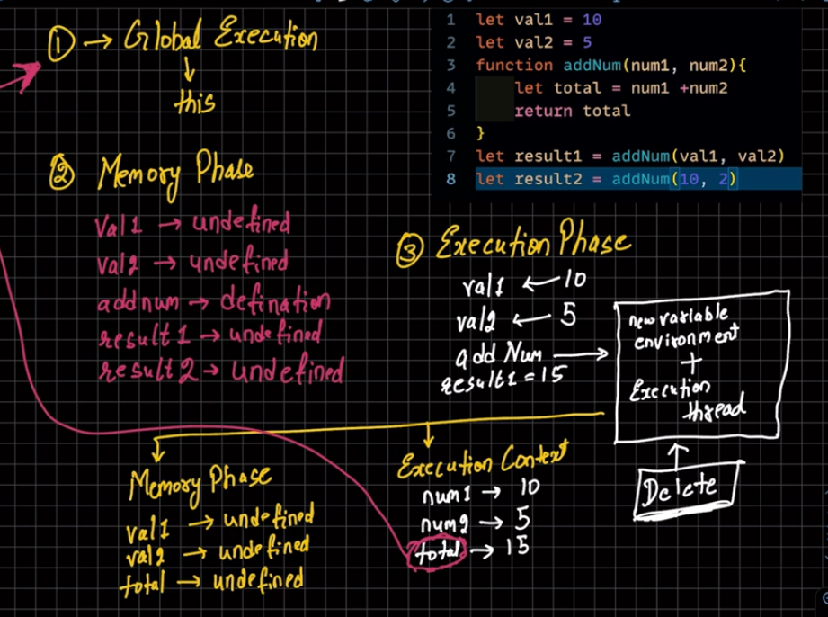

# let Or const and var
    - let aur const se declared variable ko hum bina initialize kiye use nhi kar sakte hain agar hum aise gustakhi karenge to hume error aayega jaise 
```
console.log(a)  //output:=> ReferenceError: Cannot access 'a' before initialization
console.log(b)  //output:=> ReferenceError: Cannot access 'b' before initialization
let a = 5;
const b = 8;
```
    - lekin agar hum var se koi variable declare karte hain to hum kuch aisa error milta hain
```
console.log(c); // output:=> undefined
var c = 42;
```


# JavaScript
Now I am learning JavaScript

JavaScript Execution context



# event working


# fetch Inner working
